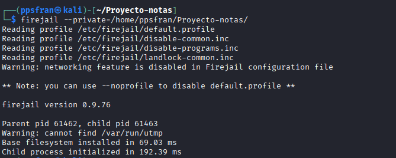
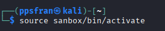
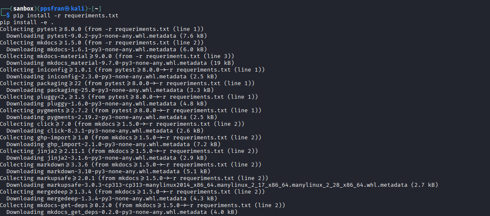
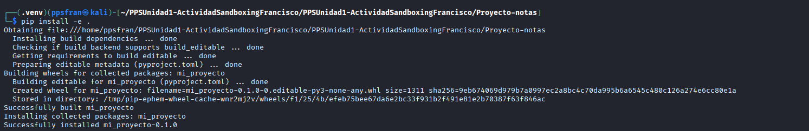
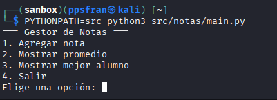

# Actividad Unidad 1 — Sandboxing (Firetools GUI)

---

## Documento donde se explica como se ejecuta lo de nota en Sanboxing (Firejail y Firetools)

---

Este documento contiene únicamente los pasos para ejecutar y documentar la aplicación `nota` usando **Firetools** (interfaz gráfica de Firejail). Incluye instalación, configuración del perfil gráfico, ejecución, y lugares donde colocar las capturas de evidencia.

## 1. Instalar Firejail y Firetools

```bash
# En Debian/Ubuntu
sudo apt update
sudo apt install -y firejail firetools
```

* **Captura de la instalación**


* **Para saber que versión tiene :**
```bash
# Verificar instalación
firejail --version
```


## 2. Primero preparar el firejail:

* Si quieres que tu aplicación acceda solo en una carpeta especifica
```bash
firejail --private=/home/ppsfran/Proyecto-notas/
```




## 3.Primero prepara el entorno para poder ejecutar las pruebas:

1. Creamos entorno virtual de Python
```bash
python3 -m venv sanbox
```


2. Activamos el entorno virtual:
```bash
source sanbox/bin/activate
```


3. Instalación de dependencias:
```bash
pip install -r requeriments.txt
pip install -e .
```




## 4. Ejecutar el programa dentro de sanbox dentro de la carpeta aislada:

* Ejecutamos el siguiente comando:
```bash
PYTHONPATH=src python3 src/notas/main.py
```




[← Volver al índice](../README.md#índice)
